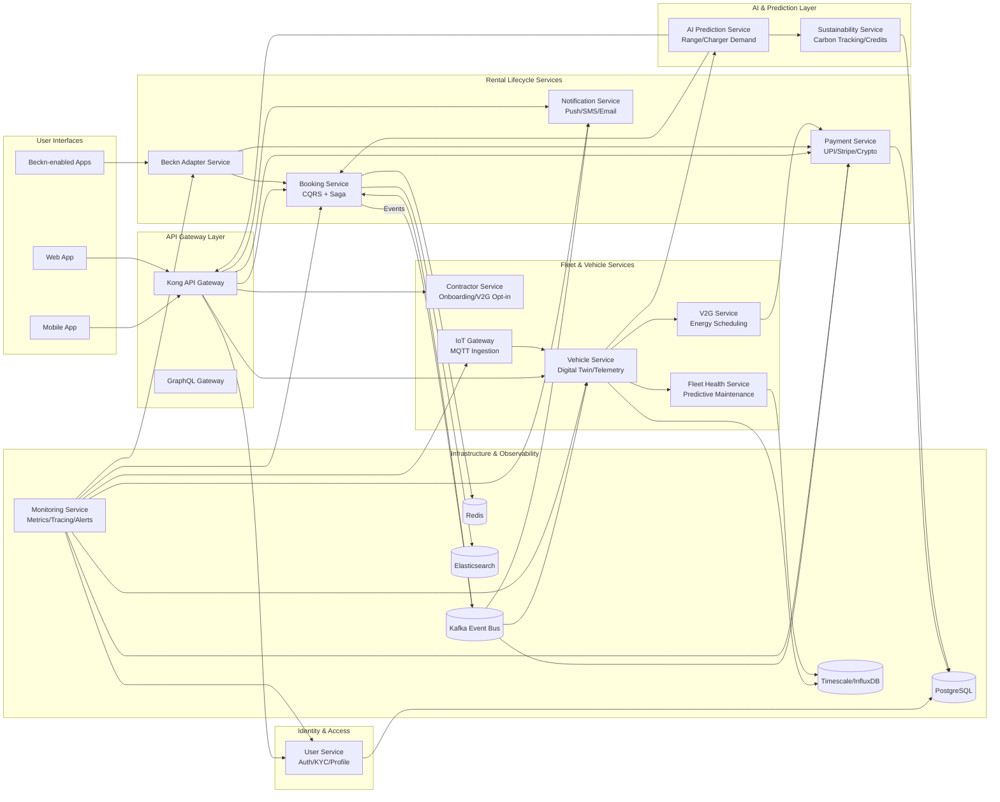

# **HYMN EV Rentals — Microservices Architecture Diagram**

## **Mermaid Diagram**

---

# **Architecture Explanation (Clear & Professional)**

## **1. Client Layer**

### **• Mobile App / Web App**

The primary user channels for browsing, booking, payments, and real-time trip assistance.

### **• Beckn-enabled Apps**

Travel, delivery, and smart-city apps can directly list HYMN EVs through the **Beckn Adapter** — dramatically expanding discovery without customer acquisition costs.

---

# **2. API Gateway Layer**

### **Kong Gateway**

* Rate limiting
* Auth enforcement
* Routing to underlying microservices
* WAF and service discovery

### **GraphQL BFF**

Provides a clean, aggregated API for UI clients to avoid chatty REST calls.

---

# **3. Identity & Access Layer**

### **User Service**

* Manages profiles, preferences, KYC
* Issues JWT/OAuth2 tokens
* Supports MFA, RBAC, anomaly detection

Stores data in **PostgreSQL** with read replicas for scale.

---

# **4. Rental Lifecycle Services**

## **Booking Service (CQRS + Saga)**

* Core of the platform
* Handles search, selection, reservation, confirmation
* Orchestrates **vehicle availability + payment hold + charger reservation**
* Uses **Kafka** to coordinate distributed transactions and rollback on failure

**Reads:** Elasticsearch
**Writes:** Redis (command state)

---

## **Payment Service**

* Integrates UPI, Razorpay, Stripe
* Handles deposits, payouts, refunds
* Crypto support for cross-border transactions
* Participates in Sagas for booking consistency

---

## **Notification Service**

* Push/SMS/email via Firebase/Twilio
* Uses **Outbox Pattern** for guaranteed delivery

---

## **Beckn Adapter Service**

* Translates Beckn protocol calls → HYMN internal APIs
* Handles `search`, `select`, `init`, `confirm`, `track`
* Ensures idempotency and digital signatures
* Connects HYMN supply to any Beckn-enabled BAP (super-apps, travel apps)

---

# **5. Fleet & Vehicle Services**

## **Contractor Service**

* Onboarding for EV owners
* Fleet listing, compliance, vetting
* V2G opt-in program
* Payouts and performance analytics

---

## **Vehicle Service (Digital Twin)**

* Real-time SOC, location, speed, battery health
* Maintains historical state using **event sourcing**
* Backed by **TimescaleDB** for time-series data

---

## **IoT Gateway**

* MQTT broker (Mosquitto) for device → cloud telemetry
* Validates, decrypts, and routes data into Kafka

Supports **offline buffering**, crucial for unstable networks.

---

## **Fleet Health Service**

* Predictive maintenance ML models
* Detects tire pressure issues, cell imbalance, overheating
* Reduces downtime ~40%

---

## **V2G Service**

* Schedules grid discharge
* Computes contractor revenue
* Ensures battery health thresholds
* Integrates with utility APIs

---

# **6. Intelligence Layer**

## **AI Prediction Service**

* Range prediction models
* Dynamic pricing intelligence
* Charger demand forecasting
* Route scoring and availability estimation
* Supports real-time recommendations to the AI Co-Pilot

Built on TensorFlow + Python, deployed on autoscaling inference servers.

---

## **Sustainability Service**

* Carbon footprint tracking
* ESG dashboards for enterprises
* Carbon credit generation & trading (blockchain-backed)

---

# **7. Infrastructure Layer**

## **Kafka Event Bus**

The backbone for:

* Booking Sagas
* Telemetry events
* Notification triggers
* V2G energy flows
* Contractor payouts

Ensures **loose coupling, high scalability, and eventual consistency**.

---

## **Datastores**

* **Postgres** → identities, payments, contractors
* **Redis** → booking commands, sessions
* **Elasticsearch** → search & availability queries
* **Timescale/InfluxDB** → vehicle telemetry, health metrics
* **MongoDB** → contractor logs, event store
* **Object Storage** → documents, logs, ML models

---

## **Monitoring Service**

* Built with Go + Prometheus + Grafana + Jaeger
* Provides:

  * Distributed tracing
  * Golden signal monitoring (latency, traffic, errors, saturation)
  * Auto-scaling triggers via HPA
  * ML-driven anomaly alerts

Ensures **99.99% uptime** and proactive issue detection.

---

# **8. Communication Patterns Summary**

### **REST/GraphQL → external clients**

### **gRPC → internal microservices**

### **Kafka → event-driven orchestration**

### **MQTT → IoT telemetry ingestion**

### **Istio → mTLS, retries, circuit breaker, canary deployments**

---

# **9. How the System Works (End-to-End Flow)**

### **A. User Books EV**

1. Mobile App → Gateway → Booking Service
2. Booking creates Saga:

   * Reserve vehicle
   * Payment hold
   * Smart charger slot reservation
3. Kafka coordinates all steps
4. Confirmation sent to user + contractor
5. Notification Service dispatches SMS/email/push

---

### **B. During Trip**

* IoT telemetry feeds Vehicle Service
* AI Prediction updates route guidance (range, chargers)
* Fleet Health monitors anomalies
* Notifications triggered proactively

---

### **C. Completion & Billing**

* Payment Service settles fare
* Contractor earnings computed
* Sustainability Service updates carbon savings
* Data pushed to corporate ESG dashboards (if applicable)

---

# **10. Why This Architecture Wins**

* **Highly scalable** — event-driven, microservices, cloud-native
* **Fail-safe** — Sagas prevent inconsistent rentals
* **Predictive** — AI models improve experience continuously
* **Open ecosystem** — Beckn makes HYMN the EV supply backend for India
* **Cost-efficient** — asset-light + serverless augmentation
* **Future-proof** — V2G and autonomous APIs built-in

HYMN becomes the **operating system for EV mobility in India**, not just another rental app.
